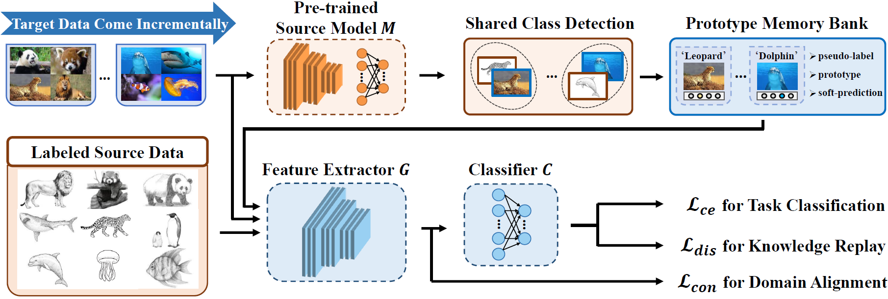

# <center>Prototype-Guided Continual Adaptation for Class-Incremental Unsupervised Domain Adaptation</center>
This repository provides the official implementation for "**Prototype-Guided Continual Adaptation for Class-Incremental Unsupervised Domain Adaptation**". (ECCV 2022)

# Paper

- We study a new yet difficult problem, called Class-incremental Unsupervised Domain Adaptation (CI-UDA), where unlabeled target samples come incrementally and only partial target classes are available at a time. Compared to vanilla UDA, CI-UDA does not assume all target data to be known in advance, and thus opens the opportunity for tackling more practical UDA scenarios in the wild.

- Meanwhile, we propose a novel ProCA to handle CI-UDA. By innovatively identifying target label prototypes, ProCA alleviates not only domain discrepancies via prototype-based alignment but also catastrophic forgetting via prototype-based knowledge replay, simultaneously. Moreover, ProCA can be applied to enhance existing partial domain adaptation methods to overcome CI-UDA.
# Getting Started
## Installation
- Clone this repository:
```
git clone https://github.com/SCUT-AILab/ProCA.git
cd ProCA
```

- Install the requirements by runing the following command:
```
pip install -r requirements.txt
```

## Data Preparation
- The `.txt` files of data list and its corresponding labels have been put in the directory `./data_splits`.

- Please manually download the Office31, Office-Home and ImageNet-Caltech benchmark from the official websites and put it in the corresponding directory (e.g., '../../dataset/ImageNet-Caltech').

- Put the corresponding `.txt` file in your path (e.g., '../../dataset/ImageNet-Caltech/caltech_list.txt').
## Source Pre-trained
- First, to obtain the pre-trained model on the source domain: 

from Art to Clipart on Office-Home-CI:
```
python OH_source_Train.py --gpu 0 --source 0
```

from Caltech256 to ImageNet84:
```
python cal256_source_Train.py --gpu 0
```

## Adapt to the Target Domain 
- Second, to train ProCA on the target domain (please assign a source-trained model path):

from Art to Clipart on Office-Home-CI:
```
python OH_adapt_2_target.py --gpu 0 --source 0 --target 1 --source_model ./model_source/20220715-1518-OH_Art_ce_singe_gpu_resnet50_best.pkl
```

from Caltech256 to ImageNet84:
```
python IC_from_c_2_i.py --gpu 0 --source_model ./model_source/20220714-1949-single_gpu_cal256_ce_resnet50_best.pkl
```


## Results
Final accuracies (%) on the **Office-Home-CI** dataset (ResNet-50).


Final accuracies (%) on the **Office-31-CI** and **ImageNet-Caltech** dataset (ResNet-50).


# Citation
If you find our work useful in your research, please cite the following paper:
```
@inproceedings{Lin2022ProCA,
  title={Prototype-Guided Continual Adaptation for Class-Incremental Unsupervised Domain Adaptation},
  author={Hongbin Lin and Yifan Zhang and Zhen Qiu and Shuaicheng Niu and Chuang Gan and Yanxia Liu and Mingkui Tan},
  booktitle={European Conference on Computer Vision},
  year={2022}
}
```

# Contact
For any question, please file an issue or contact
```
Hongbin Lin: sehongbinlin@mail.scut.edu.cn
Zhen Qiu: seqiuzhen@mail.scut.edu.cn
```
